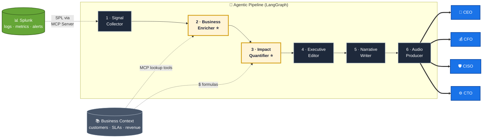
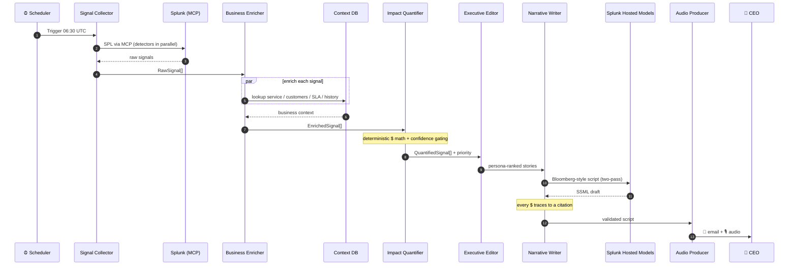

# Architecture — Splunk Executive Pulse

A multi-agent pipeline that turns Splunk operational data into a personalized
3-minute executive business briefing. Built for the **Splunk Agentic Ops
Hackathon** (tracks: Observability · Security · Platform).

## High-level pipeline



## Sequence (one nightly run)



## Agents

| # | Agent | Input → Output | Notes |
|---|-------|----------------|-------|
| 1 | Signal Collector | Splunk (MCP) → `RawSignal[]` | parallel detectors, sigma anomaly |
| 2 | **Business Enricher ⭐** | `RawSignal[]` → `EnrichedSignal[]` | the moat: joins revenue/customer/SLA/compliance/history; per-signal confidence |
| 3 | **Impact Quantifier ⭐** | `EnrichedSignal[]` → `QuantifiedSignal[]` | deterministic `$` calculators + transparent citations; priority 0–100 |
| 4 | Executive Editor | `QuantifierOutput` → `EditorOutput` | per-persona clustering, ranking, decision extraction |
| 5 | Narrative Writer | `EditorOutput` → `NarrativeScript` | two-pass LLM, citation enforcement, Bloomberg tone |
| 6 | Audio Producer | `NarrativeScript` → mp3 | ElevenLabs SSML |

## Data contract

All inter-agent data flows through typed Pydantic models. `RawSignal` is the
contract between Signal Collector and Business Enricher (schemas are kept
identical across the two modules). Upstream types are single-sourced in
`agents/business_enricher/models.py` and imported downstream.

## Anti-hallucination

Every `$` figure carries: source SPL query, calculation formula, and a
confidence score. If enrichment confidence `< 0.4`, the briefing falls back to
qualitative language — no fabricated numbers. The Narrative Writer enforces that
every dollar amount in the script maps to a citation, and a determinism test
verifies the figures do not drift across runs.

## Hackathon alignment

**Tracks covered (cross-track):** Observability (anomaly detection over Splunk
data), Security (credential-stuffing / threat signals), Platform & DevEx (a new
agentic product layer on top of Splunk).

**Required Splunk capabilities used:**

| Capability | Where in the code |
|---|---|
| **Splunk MCP Server** | `agents/signal_collector/splunk_mcp.py` (`search` dispatch→poll→fetch); MCP lookup tools in `agents/business_enricher/tools.py` |
| **Splunk Hosted Models** | `agents/narrative_writer/llm_client.py` — primary LLM, Anthropic/OpenAI fallback only |
| **Splunk AI Assistant for SPL** | `agents/common/splunk_ai/spl_assistant.py` — NL→SPL for detector queries and the executive **drill-down loop** (`orchestration/drilldown_demo.py`) |
| **Splunk AI Toolkit (MLTK)** | `agents/common/splunk_ai/mltk.py` — `anomalydetection` / `fit`+`apply` / `predict` SPL for native anomaly detection and latency forecasting (vs. hand-rolled sigma) |
| **AI agents** | 6-agent LangGraph pipeline above |

### Drill-down loop (briefing → investigation)

After the brief, an executive asks a plain-English follow-up; the AI Assistant
for SPL turns it into SPL that runs through the MCP search tool — closing the
loop from "what happened" to "show me." Runs zero-infra via an offline
phrasebook fallback when no live Assistant is configured.

**Judging criteria mapping:**

- *Technological Implementation* — typed multi-agent pipeline, deterministic
  financial math, anti-hallucination tests (30 unit tests + 3 Hypothesis property
  tests = 33 automated tests passing).
- *Design* — audio-first 3-minute brief, per-persona personalization.
- *Potential Impact* — expands Splunk's audience from engineers to the C-suite.
- *Quality of Idea* — the Business Context Layer is a defensible moat, not an
  LLM wrapper.

## Run the deterministic backbone (zero infra / zero API keys)

```bash
python orchestration/pipeline.py --persona CEO
```

Collector (mock Splunk) → Enricher (CSV store) → Quantifier → Editor. The
Narrative Writer and Audio Producer run after the Editor and require
`SPLUNK_LLM_*` / `ELEVENLABS_API_KEY` credentials.
